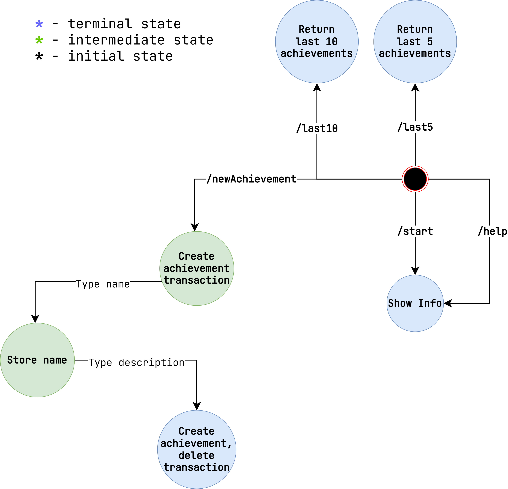

# Achievements Tracker Telegram Bot

## Status

## Description

Telegram bot that helps to track personal achievements.

There are tons of books and articles that point out that it's essential to keep the recors of the
things you've accomplished. Not only it increases your self-esteem, but gives a motivation to move
forward.

Achievements Tracker was brought to automate the proccess. Have you read a book? Check it! Have you
written an article? Check it! Have you recorded a song? Check it!
Afterwards, you can list all of your accomplishments to see how much you've done already.

## Bot States

